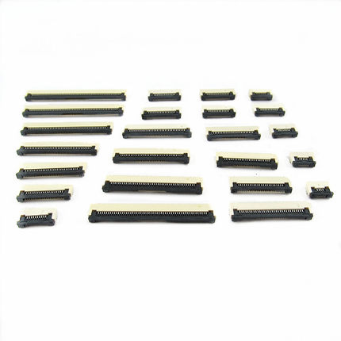
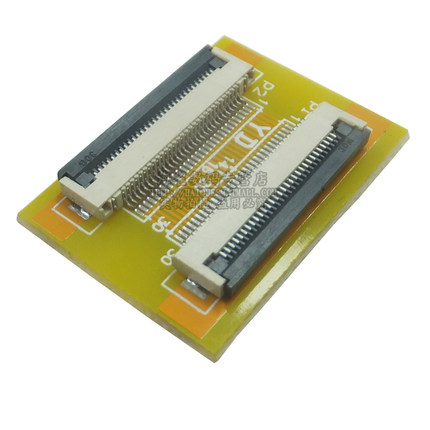
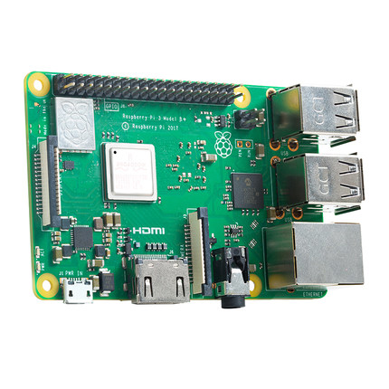
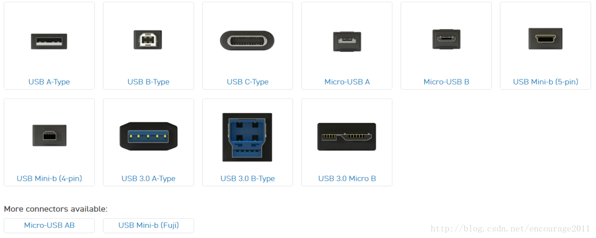
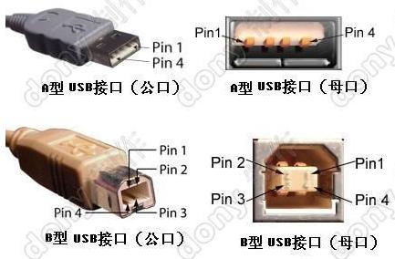

## 连接器件线材
[toc]
连接器就是平时称之为“插座”的东西，但要到具体设计时，必须弄明白这个“插座”叫什么，怎么用，有什么限制。
线材指的就是平时我们使用的飞线、电源线、杜邦线之类，不同的线材粗细也有相应的标准，在设计时一定要考虑其功能特性，就比如，不能指望杜邦线那种特别细的线去承载40A的大电流，也不能让拇指那么粗的电线大材小用去传导普通的信号。

### 线材标号规格
在航模中常用的是AWG规格。
AWG（American wire gauge）美国线规，是一种区分导线直径的标准，又被称为 Brown & Sharpe线规。
|  AWG标号 | 额定/最大电流(A) | AWG标号| 额定/最大电流(A) |
|:-------:|:----------:|:------:|:----------:|
|0000|423.2/482.6|22|1.28/1.46|
|000|335.5/382.6|23|1.022/1.165|
|00|266.2/303.5|24|0.808/0.921|
|0|211.1/240.7|25|0.641/0.731|
|1|167.4/190.9|26|0.506/0.577|
|2|132.7/151.3|27|0.403/0.460|
|3|105.2/120|28|0.318/0.362|
|4|83.5/95.2|29|0.255/0.291|
|5|66.2/75.5|30|0.2/0.228|
|6|52.5/59.9|31|0.158/0.181|
|7|41.6/47.5|32|0.128/0.146|
|8|33/37.7|33|0.101/0.115|
|9|26.2/29.8|34|0.079/0.091|
|10|20.8/23.7|35|0.063/0.072|
|11|16.5/18.8|36|0.05/0.057|
|12|13.1/14.9|37|0.041/0.046|
|13|10.4/11.8|38|0.032/0.036|
|14|8.2/9.4|39|0.025/0.028|
|15|6.5/7.4|40|0.019/0.022|
|16|5.2/5.9|41|0.016/0.018|
|17|4.1/4.7|42|0.013/0.014|
|18|3.2/3.7|43|0.010/0.011|
|19|2.6/2.9|44|0.008/0.009|
|20|2/2.3|45|0.006/0.007|
|21|1.6/1.9|46|0.005/0.06|
<!-- AWG规格信息 -->

### FFC/FPC
FFC指的是Flexible Flat Cable，平时所说FPC线和FFC指的是一个东西，而FPC指的是Flexible Printed Circuit board,柔性印刷电路板，通俗讲就是用软性材料（可以折叠、弯曲的材料）做成的PCB。

上图为FPC板

上图为FPC软排线（准确地说应该称之为FFC排线）
FPC软排线的间距有各种规格，如0.5mm、0.8mm、1.0mm、1.25mm、1.27mm、1.5mm、2.0mm、2.54mm等。

上图为FPC连接器，间距规格与FPC排线规格类似。其以卡住排线的方式分为上/下接翻盖式、抽屉式、和无锁等几种；又以焊接方式分为直插、贴片，且两者又各自分为立式和卧式

上为卧式
下为立式(实在找不到单独的图片了，板子最左侧的连接器即为立式FPC连接器)

### USB
通用串行总线（英语：Universal Serial Bus，缩写：USB）是连接计算机系统与外部设备的一种串口总线标准，也是一种输入输出接口的技术规范。

USB设备是向下兼容的，比如一些老电脑的接口可能都是USB2.0-TypeA母座，也可以插入USB3.0的U盘使用，但实际上此时U盘运行是按照USB2.0的规范，传输速率亦是如此。
#### USB2.0

其中ID脚在OTG功能中才使用。由于Mini-USB接口分Mini-A、B和AB接口。如果你的系统仅仅是用做Slave，那么就使用B接口。 系统控制器会判断ID脚的电平判断是什么样的设备插入，如果是高电平，则是B接头插入，此时系统就做主模式(master mode) ；如果ID为低，则是A接口插入，然后系统就会使用HNP对话协议来决定哪个做Master，哪个做Slave。这些说明为技术人员总结的，仅供参考。
### HDMI
<!-- HDMI -->
### 排针
<!-- 排针 -->
### 