# PCB设计术语解释
### 铜箔copper

### 过孔via

### 焊盘pad

### 走线track

### 铺铜(敷铜)polygon

## 封装
### BGA(ball grid array) 
球形触点陈列，表面贴装型封装之一。在印刷基板的背面按陈列方式制作出球形凸点用 以 代替引脚，在印刷基板的正面装配LSI 芯片，然后用模压树脂或灌封方法进行密封。也 称为凸 点陈列载体(PAC)。引脚可超过200，是多引脚LSI 用的一种封装。 封装本体也可做得比QFP(四侧引脚扁平封装)小。例如，引脚中心距为1.5mm 的360 引脚 BGA 仅为31mm 见方；而引脚中心距为0.5mm 的304 引脚QFP 为40mm 见方。而且BGA 不 用担心QFP 那样的引脚变形问题。 该封装是美国Motorola 公司开发的，首先在便携式电话等设备中被采用，今后在美国有 可 能在个人计算机中普及。最初，BGA 的引脚(凸点)中心距为1.5mm，引脚数为225。现在 也有 一些LSI 厂家正在开发500 引脚的BGA。 BGA 的问题是回流焊后的外观检查。现在尚不清楚是否有效的外观检查方法。有的认为 ， 由于焊接的中心距较大，连接可以看作是稳定的，只能通过功能检查来处理。 美国Motorola 公司把用模压树脂密封的封装称为OMPAC，而把灌封方法密封的封装称为 GPAC(见OMPAC 和GPAC)。 
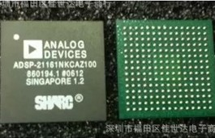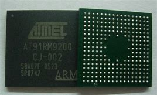

### LGA(land grid array) 
触点陈列封装。即在底面制作有阵列状态坦电极触点的封装。装配时插入插座即可。现 已 实用的有227 触点(1.27mm 中心距)和447 触点(2.54mm 中心距)的陶瓷LGA，应用于高速 逻辑 LSI 电路。 LGA 与QFP 相比，能够以比较小的封装容纳更多的输入输出引脚。另外，由于引线的阻 抗 小，对于高速LSI 是很适用的。但由于插座制作复杂，成本高，现在基本上不怎么使用 。预计 今后对其需求会有所增加。
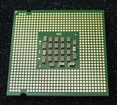

### PGA(pin grid array(surface mount type))
表面贴装型PGA。通常PGA 为插装型封装，引脚长约3.4mm。表面贴装型PGA 在封装的 底面有陈列状的引脚，其长度从1.5mm 到2.0mm。贴装采用与印刷基板碰焊的方法，因而 也称 为碰焊PGA。因为引脚中心距只有1.27mm，比插装型PGA 小一半，所以封装本体可制作得 不 怎么大，而引脚数比插装型多(250～528)，是大规模逻辑LSI 用的封装。封装的基材有 多层陶 瓷基板和玻璃环氧树脂印刷基数。以多层陶瓷基材制作封装已经实用化。 
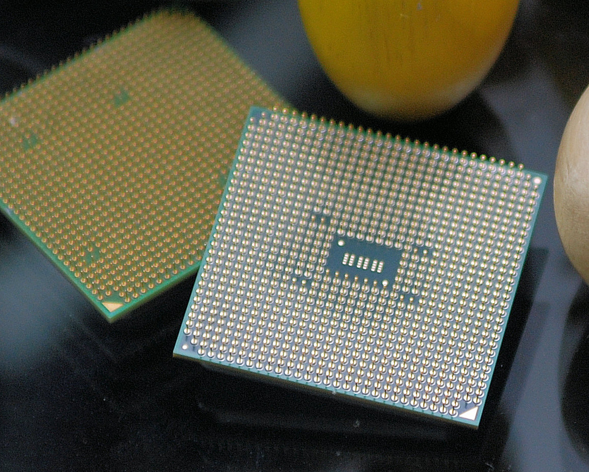

### PLCC(plastic leaded chip carrier) 
带引线的塑料芯片载体。表面贴装型封装之一。引脚从封装的四个侧面引出，呈丁字形 ， 是塑料制品。美国德克萨斯仪器公司首先在64k 位DRAM 和256kDRAM 中采用，现在已经 普 及用于逻辑LSI、DLD(或程逻辑器件)等电路。引脚中心距1.27mm，引脚数从18 到84。 J 形引脚不易变形，比QFP 容易操作，但焊接后的外观检查较为困难。 PLCC 与LCC(也称QFN)相似。以前，两者的区别仅在于前者用塑料，后者用陶瓷。但现 在已经出现用陶瓷制作的J 形引脚封装和用塑料制作的无引脚封装(标记为塑料LCC、PC LP、P －LCC 等)，已经无法分辨。为此，japon电子机械工业会于1988 年决定，把从四侧引出 J 形引 脚的封装称为QFJ，把在四侧带有电极凸点的封装称为QFN(见QFJ 和QFN)。 
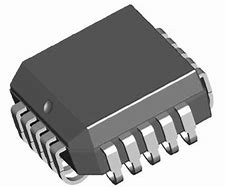

### QFP(quad flat package) 
四侧引脚扁平封装。表面贴装型封装之一，引脚从四个侧面引出呈海鸥翼(L)型。基材有 陶 瓷、金属和塑料三种。从数量上看，塑料封装占绝大部分。当没有特别表示出材料时， 多数情 况为塑料QFP。塑料QFP 是最普及的多引脚LSI 封装。不仅用于微处理器，门陈列等数字 逻辑LSI 电路，而且也用于VTR 信号处理、音响信号处理等模拟LSI 电路。引脚中心距 有1.0mm、0.8mm、 0.65mm、0.5mm、0.4mm、0.3mm 等多种规格。0.65mm 中心距规格中最多引脚数为304。 
japon将引脚中心距小于0.65mm 的QFP 称为QFP(FP)。但现在japon电子机械工业会对QFP 的外形规格进行了重新评价。在引脚中心距上不加区别，而是根据封装本体厚度分为 QFP(2.0mm～3.6mm 厚)、LQFP(1.4mm 厚)和TQFP(1.0mm 厚)三种。 
另外，有的LSI 厂家把引脚中心距为0.5mm 的QFP 专门称为收缩型QFP 或SQFP、VQFP。 但有的厂家把引脚中心距为0.65mm 及0.4mm 的QFP 也称为SQFP，至使名称稍有一些混乱 。 QFP 的缺点是，当引脚中心距小于0.65mm 时，引脚容易弯曲。为了防止引脚变形，现已 出现了几种改进的QFP 品种。如封装的四个角带有树指缓冲垫的BQFP(见BQFP)；带树脂 保护 环覆盖引脚前端的GQFP(见GQFP)；在封装本体里设置测试凸点、放在防止引脚变形的专 用夹 具里就可进行测试的TPQFP(见TPQFP)。 在逻辑LSI 方面，不少开发品和高可靠品都封装在多层陶瓷QFP 里。引脚中心距最小为 0.4mm、引脚数最多为348 的产品也已问世。此外，也有用玻璃密封的陶瓷QFP(见Gerqa d)。

### BQFP(quad flat package with bumper) 
带缓冲垫的四侧引脚扁平封装。QFP 封装之一，在封装本体的四个角设置突起(缓冲垫) 以 防止在运送过程中引脚发生弯曲变形。美国半导体厂家主要在微处理器和ASIC 等电路中 采用 此封装。引脚中心距0.635mm，引脚数从84 到196 左右(见QFP)。 
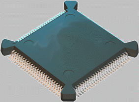

### CQFP(quad fiat package with guard ring) 
带保护环的四侧引脚扁平封装。塑料QFP 之一，引脚用树脂保护环掩蔽，以防止弯曲变 形。 在把LSI 组装在印刷基板上之前，从保护环处切断引脚并使其成为海鸥翼状(L 形状)。 这种封装 在美国Motorola 公司已批量生产。引脚中心距0.5mm，引脚数最多为208 左右。 
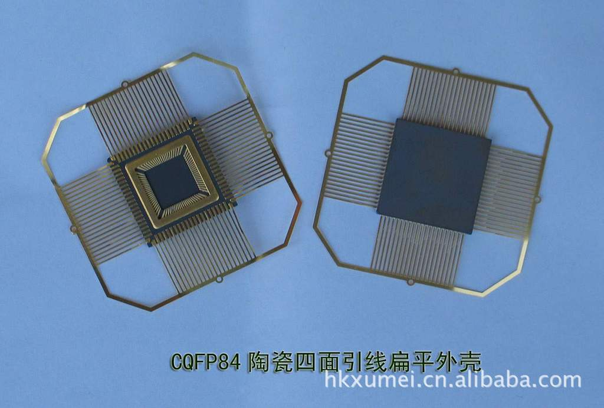

### FQFP(fine pitch quad flat package) 
小引脚中心距QFP。通常指引脚中心距小于0.65mm 的QFP(见QFP)。部分导导体厂家采 用此名称。 
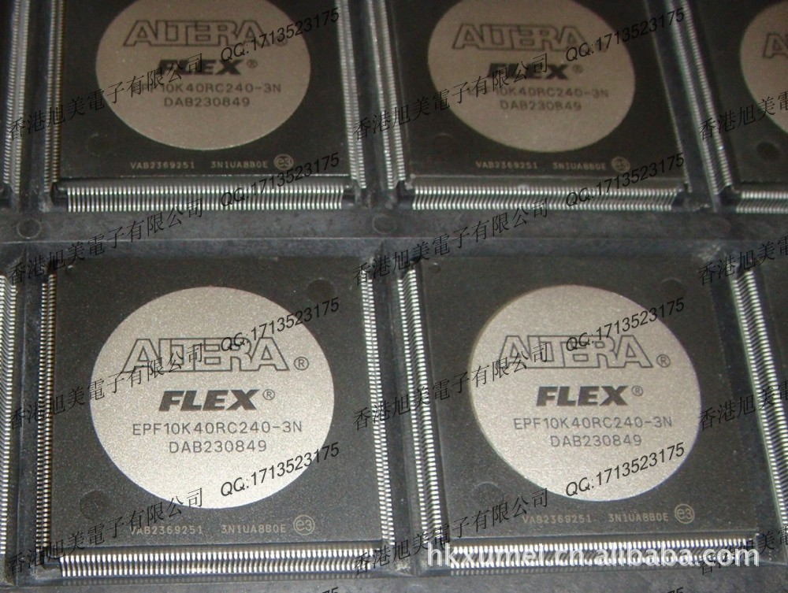

### LQFP(low profile quad flat package) 
薄型QFP。指封装本体厚度为1.4mm 的QFP，是japon电子机械工业会根据制定的新QFP 外形规格所用的名称。 
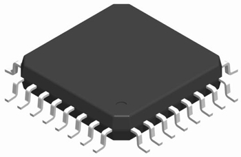

### DIP(dual in-line package) 
双列直插式封装。插装型封装之一，引脚从封装两侧引出，封装材料有塑料和陶瓷两种 。 DIP 是最普及的插装型封装，应用范围包括标准逻辑IC，存贮器LSI，微机电路等。 引脚中心距2.54mm，引脚数从6 到64。封装宽度通常为15.2mm。有的把宽度为7.52mm 和10.16mm 的封装分别称为skinny DIP 和slim DIP(窄体型DIP)。但多数情况下并不加 区分， 只简单地统称为DIP。另外，用低熔点玻璃密封的陶瓷DIP 也称为cerdip(见cerdip)。 
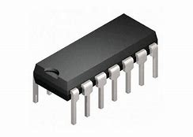

### QFN(quad flat non-leaded package) 
四侧无引脚扁平封装。表面贴装型封装之一。现在多称为LCC。QFN 是japon电子机械工业 会规定的名称。封装四侧配置有电极触点，由于无引脚，贴装占有面积比QFP 小，高度 比QFP 低。但是，当印刷基板与封装之间产生应力时，在电极接触处就不能得到缓解。因此电 极触点 难于作到QFP 的引脚那样多，一般从14 到100 左右。 材料有陶瓷和塑料两种。当有LCC 标记时基本上都是陶瓷QFN。电极触点中心距1.27mm。 
塑料QFN 是以玻璃环氧树脂印刷基板基材的一种低成本封装。电极触点中心距除1.27mm 外， 还有0.65mm 和0.5mm 两种。这种封装也称为塑料LCC、PCLC、P－LCC 等。 

### SMD(surface mount devices) 
表面贴装器件。偶而，有的半导体厂家把SOP 归为SMD(见SOP)。 
关于SMD,平时用的比较多的就是贴片电阻电容电感，比如0603、0402、0201等封装的贴片器件。平时购买元件时，0603、0402指的是两个引脚的器件，如果是多个引脚的，一般称之为0603、0402的排阻、排容
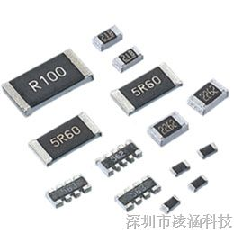

### SOT(Small Outline Transistor)
SOT是一种表面贴装的封装形式，一般引脚小于等于5个的小外形晶体管。
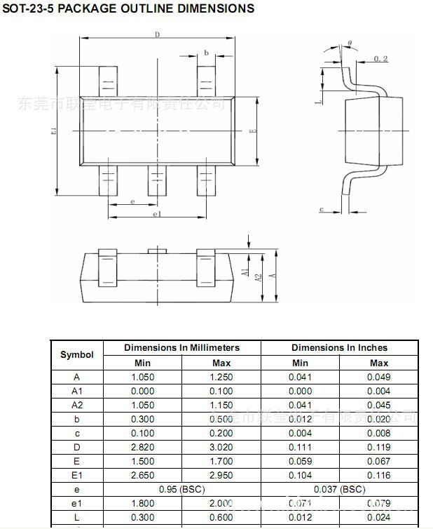
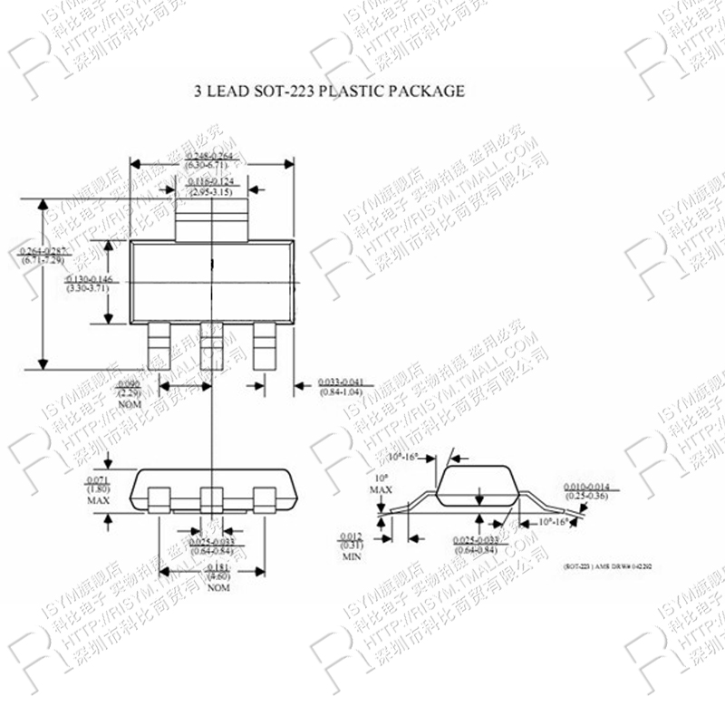

### SOD(Small Outline Diode)
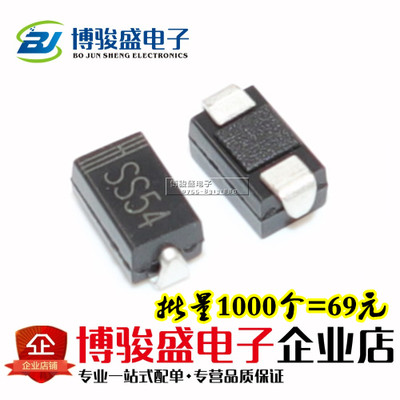

### SOP(Small Outline Package)
SOP封装是一种元件封装形式，常见的封装材料有:塑料、陶瓷、玻璃、金属等，现在基本采用塑料封装.，应用范围很广，主要用在各种集成电路中。
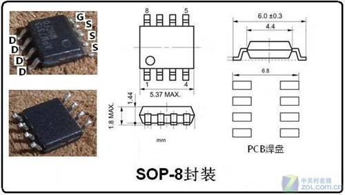

### SIP(single in-line package) 
单列直插式封装。引脚从封装一个侧面引出，排列成一条直线。当装配到印刷基板上时 封 装呈侧立状。引脚中心距通常为2.54mm，引脚数从2 至23，多数为定制产品。封装的形 状各 异。也有的把形状与ZIP 相同的封装称为SIP。 
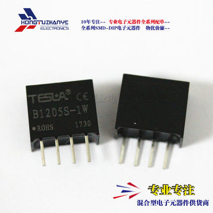

## 连接器件线材
连接器就是平时称之为“插座”的东西，但要到具体设计时，必须弄明白这个“插座”叫什么，怎么用，有什么限制。
线材指的就是平时我们使用的飞线、电源线、杜邦线之类，不同的线材粗细也有相应的标准，在设计时一定要考虑其功能特性，就比如，不能指望杜邦线那种特别细的线去承载40A的大电流，也不能让拇指那么粗的电线大材小用去传导普通的信号。
### FFC/FPC
FFC指的是Flexible Flat Cable，平时所说FPC线和FFC指的是一个东西，而FPC指的是Flexible Printed Circuit board,柔性印刷电路板，通俗讲就是用软性材料（可以折叠、弯曲的材料）做成的PCB。
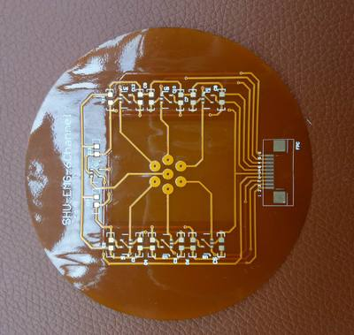

上图为FPC板
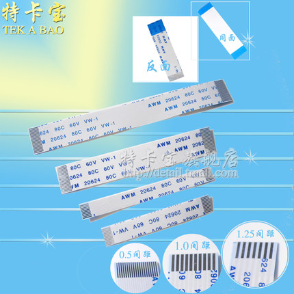

上图为FPC软排线（准确地说应该称之为FFC排线）
FPC软排线的间距有各种规格，如0.5mm、0.8mm、1.0mm、1.25mm、1.27mm、1.5mm、2.0mm、2.54mm等。
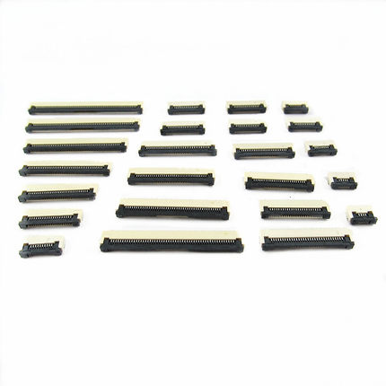
上图为FPC连接器，间距规格与FPC排线规格类似。其以卡住排线的方式分为上/下接翻盖式、抽屉式、和无锁等几种；又以焊接方式分为直插、贴片，且两者又各自分为立式和卧式
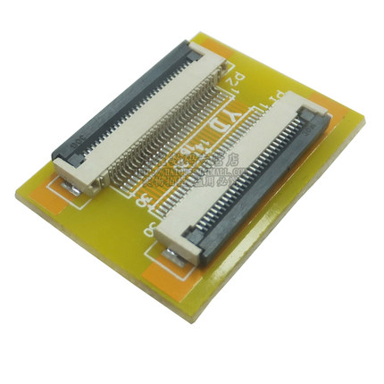
上为卧式
下为立式(实在找不到单独的图片了，板子最左侧的连接器即为立式FPC连接器)
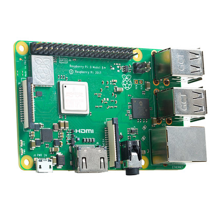
### 线材标号规格
常用的是AWG规格。
AWG（American wire gauge）美国线规，是一种区分导线直径的标准，又被称为 Brown & Sharpe线规。
|  AWG标号 | 额定/最大电流(A) | AWG标号| 额定/最大电流(A) |
|:-------:|:----------:|:------:|:----------:|
|0000|423.2/482.6|22|1.28/1.46|
|000|335.5/382.6|23|1.022/1.165|
|00|266.2/303.5|24|0.808/0.921|
|0|211.1/240.7|25|0.641/0.731|
|1|167.4/190.9|26|0.506/0.577|
|2|132.7/151.3|27|0.403/0.460|
|3|105.2/120|28|0.318/0.362|
|4|83.5/95.2|29|0.255/0.291|
|5|66.2/75.5|30|0.2/0.228|
|6|52.5/59.9|31|0.158/0.181|
|7|41.6/47.5|32|0.128/0.146|
|8|33/37.7|33|0.101/0.115|
|9|26.2/29.8|34|0.079/0.091|
|10|20.8/23.7|35|0.063/0.072|
|11|16.5/18.8|36|0.05/0.057|
|12|13.1/14.9|37|0.041/0.046|
|13|10.4/11.8|38|0.032/0.036|
|14|8.2/9.4|39|0.025/0.028|
|15|6.5/7.4|40|0.019/0.022|
|16|5.2/5.9|41|0.016/0.018|
|17|4.1/4.7|42|0.013/0.014|
|18|3.2/3.7|43|0.010/0.011|
|19|2.6/2.9|44|0.008/0.009|
|20|2/2.3|45|0.006/0.007|
|21|1.6/1.9|46|0.005/0.06|
<!-- AWG规格信息 -->
### USB
#### USB2.0
<!-- USB -->

### HDMI
<!-- HDMI -->
### 排针
<!-- 排针 -->
### 

## 焊接设备及工艺