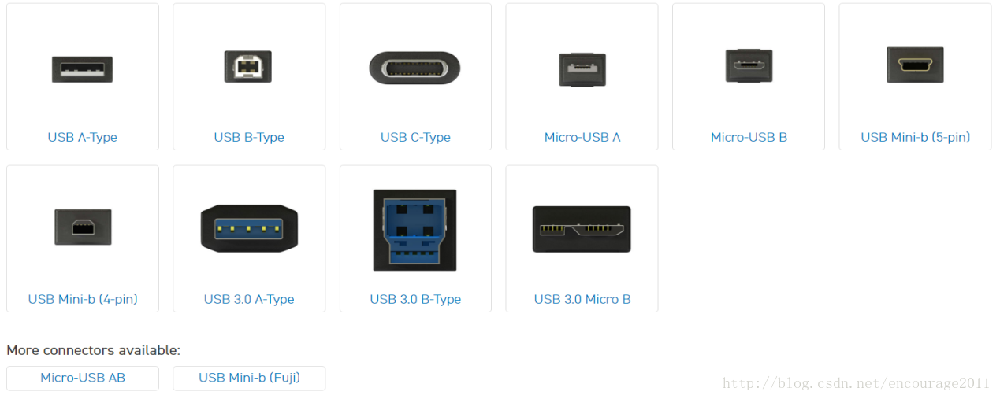
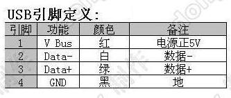
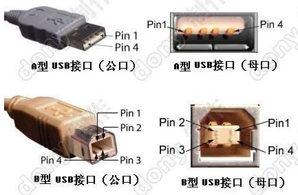
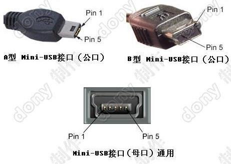
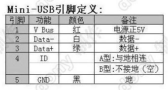

# PCB设计术语解释
### 铜箔copper

### 过孔via

### 焊盘pad

### 走线track

### 铺铜(敷铜)polygon

## 连接器件线材
连接器就是平时称之为“插座”的东西，但要到具体设计时，必须弄明白这个“插座”叫什么，怎么用，有什么限制。
线材指的就是平时我们使用的飞线、电源线、杜邦线之类，不同的线材粗细也有相应的标准，在设计时一定要考虑其功能特性，就比如，不能指望杜邦线那种特别细的线去承载40A的大电流，也不能让拇指那么粗的电线大材小用去传导普通的信号。
### FFC/FPC
FFC指的是Flexible Flat Cable，平时所说FPC线和FFC指的是一个东西，而FPC指的是Flexible Printed Circuit board,柔性印刷电路板，通俗讲就是用软性材料（可以折叠、弯曲的材料）做成的PCB。

上图为FPC板

上图为FPC软排线（准确地说应该称之为FFC排线）
FPC软排线的间距有各种规格，如0.5mm、0.8mm、1.0mm、1.25mm、1.27mm、1.5mm、2.0mm、2.54mm等。

上图为FPC连接器，间距规格与FPC排线规格类似。其以卡住排线的方式分为上/下接翻盖式、抽屉式、和无锁等几种；又以焊接方式分为直插、贴片，且两者又各自分为立式和卧式

上为卧式
下为立式(实在找不到单独的图片了，板子最左侧的连接器即为立式FPC连接器)

### USB
通用串行总线（英语：Universal Serial Bus，缩写：USB）是连接计算机系统与外部设备的一种串口总线标准，也是一种输入输出接口的技术规范。

USB设备是向下兼容的，比如一些老电脑的接口可能都是USB2.0-TypeA母座，也可以插入USB3.0的U盘使用，但实际上此时U盘运行是按照USB2.0的规范，传输速率亦是如此。
#### USB2.0

其中ID脚在OTG功能中才使用。由于Mini-USB接口分Mini-A、B和AB接口。如果你的系统仅仅是用做Slave，那么就使用B接口。 系统控制器会判断ID脚的电平判断是什么样的设备插入，如果是高电平，则是B接头插入，此时系统就做主模式(master mode) ；如果ID为低，则是A接口插入，然后系统就会使用HNP对话协议来决定哪个做Master，哪个做Slave。这些说明为技术人员总结的，仅供参考。
### HDMI
<!-- HDMI -->
### 排针
<!-- 排针 -->
### 

## 焊接设备及工艺