# 焊接设备及工艺
> 太长不看：
> + 选型风枪时要选择焊接用的风枪
> + 在焊台和电烙铁之间优先选择焊台
> + 烙铁头常用刀头
> + 助焊剂建议用石蜡松香混合液
[toc]
## 热风枪
热风枪是热风机利用发热电阻丝的枪芯，将热风吹出来，对元件进行焊接的使用工具。热风枪是维修热风机装置的重要工具之一，主要由气泵，气流稳定器，线型的电路板，手把，外壳等基本元件装置，它的最主要作用是拆分和焊接小贴片元件和其集成电路。
### 用途
热风枪在很多的地方都有用到，例如：
1. 可去除金属表面旧漆，配合热风喷嘴及刮除具时使用效果更好。
2. 可去除自粘性贴纸。
3. 可解除生锈或是太紧的螺帽及金属螺丝；
4. 可弯曲塑料胶管。
5. 在处理油垢或更换旧磨粉前，可先行软化；
6. 可将受潮的木头变干。
7. 可热收缩包装膜、包装管。
8. 可收缩连接金属用的聚乙烯物；
9. 软化焊接物
### 风枪和风枪是不一样的！！！
注意，市面上有两种不同用途的热风加热设备都叫热风枪，然而在焊接上使用的主要是下两图的第一个，其可以进行更精确地控制出风温度；而第二个主要是面向更大风量更高温度设计，温控较差易损毁IC。
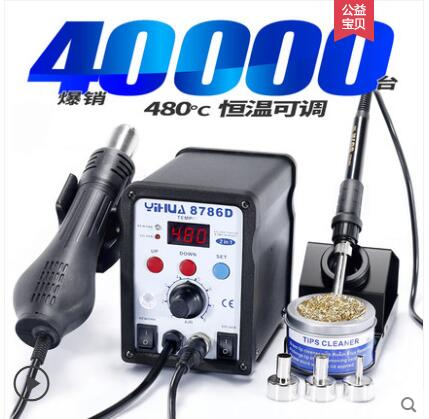
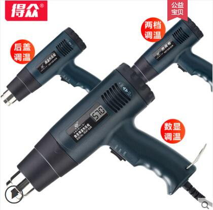
## 焊台&电烙铁
从本质上说，焊台也是电烙铁的一种，只是在电子焊接发展过程中因为焊接技术的发展要求而出现的新的焊接工具，所以现在有好些人把焊台还是叫电烙铁，其实现在的焊台已经有了很大的发展，品牌上有了很多，在功能上有了很大的发展！ 
### 焊台
焊台是一种常用于电子焊接工艺的手动工具，通过给焊料（通常是指锡丝）供热，使其熔化，从而使两个工件焊接起来。 
焊台的组成：控制台，手柄（由绝缘材料，发热芯和烙铁头组成），烙铁架构成。 
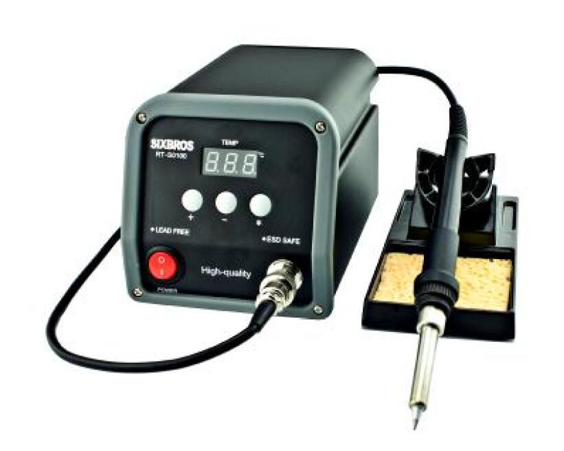
### 电烙铁
一般意义上的电烙铁，是我们说的单柄电烙铁，有内热式电烙铁，外热式电烙铁，可调温电烙铁。从材料上说，有木柄电烙铁，塑柄电烙铁等！ 电烙铁的组成：电烙铁由（手柄）、（连接杆）、（弹簧夹）、（烙铁芯、烙铁头)  等部分组成.
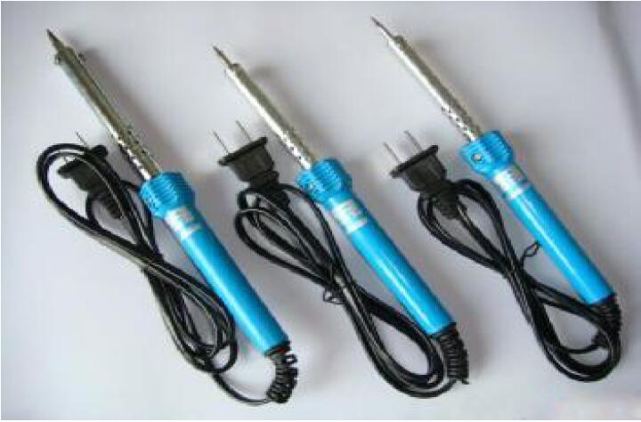
内热式电烙铁和外热式电烙铁的不同他们的结构也有区别：
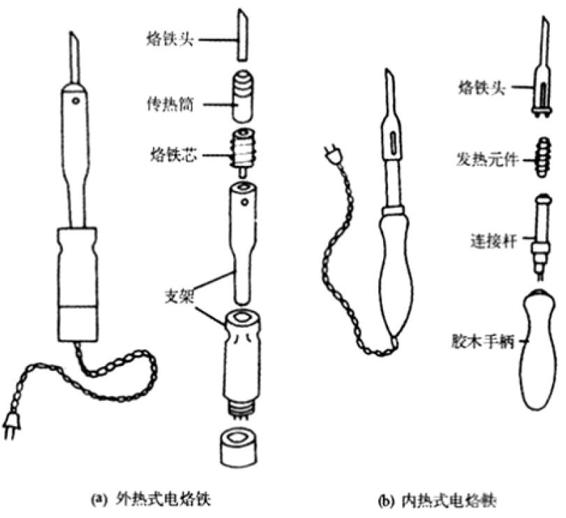
### 焊台和电烙铁的优势对比
1.  效率比较
    恒温焊台的效率相对较高，热效率可以达到80%左右，电烙铁一般能有50%就不错了；
2. 能耗比较
    恒温焊台能耗比较低，因为到了调节好的温度，就不在加温，相应的能耗较低，也就是说，同样的焊接效果，焊台用电较少；
3. 回温比较
    焊台的回温速度较快，相应的工人的工作效率较高；
4. 耗材寿命比较
    焊台的温度得到控制，不会无限升高，所以，烙铁头的寿命和发热芯的寿命较高；
5. 安全比较
    焊台的手柄电压只有交流的24 伏，属于安全电压，一般不会出现触电现象；
6. 防静电比较
    焊台具有除静电功能，但电烙铁一般没有的。
### 烙铁头
烙铁头为电烙铁的配套产品，其为一体合成。烙铁头、烙铁咀、焊咀同为一种产品，是电烙铁、电焊台的配套产品，主要材料为铜属于易耗品。
#### 选型
下图中为常用类型的刀咀。
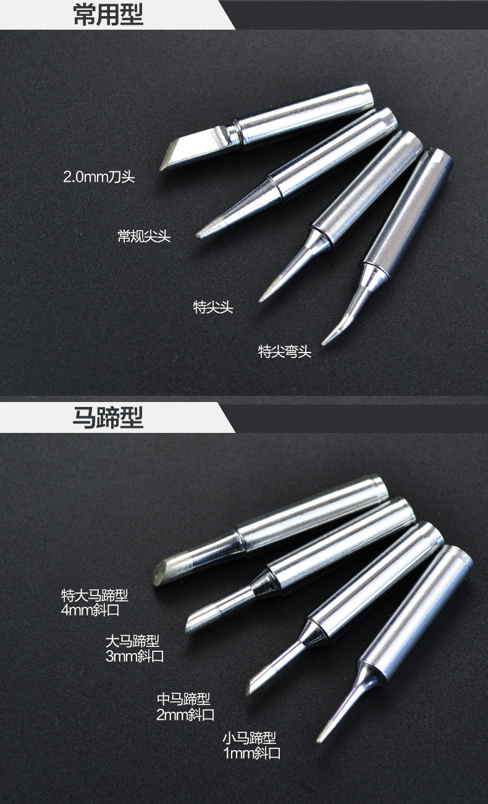
不同的应用场景需要用到不同类型的刀咀。有一个大致的选型经验：引脚密集的贴片元件和直插类型的器件建议使用刀头；0603、0402等尺寸较小的阻容器件建议使用特尖头；需要融化较大量的焊锡时建议使用马蹄头。
#### 用法注意
+ 温度过高会加速烙铁头氧化，一般焊接建议温度在350度左右，最高温度不建议超过400度
    > 氧化后的烙铁头无法上锡，液态的锡会形成小液珠而不是附着在烙铁头上，烙铁头报废。
+ 使用后将烙铁头裹上锡再断电降温收起
+ 不要用刀刮烙铁头的防氧化镀层
+ 不要用酸性的助焊剂
    > 酸性助焊剂会腐蚀防氧化镀层，助焊剂选型转到助焊剂有关部分

## 辅助小工具

### 助焊剂
助焊剂的主要作用是降低焊锡熔点。
#### 选型
常见类型如下。
+ 松香
    > 最基础(便宜)的助焊剂，助焊效果最一般，焊锡液化效果最差，焊点不漂亮，且易发黑需要清洗。但松香的绝缘性极佳，甚至在一些情况下可以代替三防漆使用。
    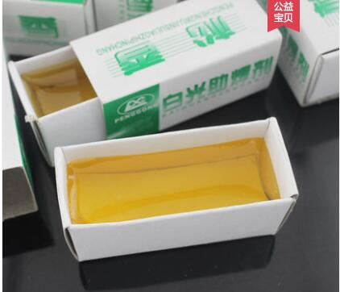
+ 石蜡松香混合液
    > 松香的进阶，助焊效果有很大提升，但比酸性焊锡膏差一些，不易发黑，可以不洗，但用之后板子上黏糊糊的。
+ 酸性焊锡膏
    > 便宜且焊锡液化效果很棒，但会腐蚀烙铁头，更糟糕的是绝缘性很差，甚至会导电。直插式器件可以用一用，精密器件尤其是BGA、QFN等封装的器件万不可用，真的会出现短路。
    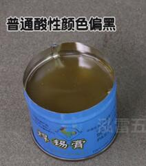
+ BGA助焊膏
    > 很贵，但助焊效果极佳，不导电，不发黑，不腐蚀，免洗。
    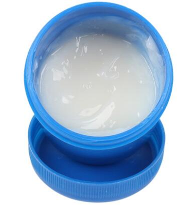

### 吸锡带
吸锡带主要用于吸取多余的焊锡。在拆焊中，芯片取掉以后，电路板上还会有大量的焊锡，这会影响芯片的焊接。通常采用吸锡带清理，方法是把烙铁放在吸锡带上然后在芯片焊盘上缓缓移动，等焊锡融了就会被锡吸带吸起，吸尽管脚间的锡，这样清理的印制板很干净。

### 吸锡器
吸锡器是一种修理电器用的工具，收集拆卸焊盘电子元件时融化的焊锡。
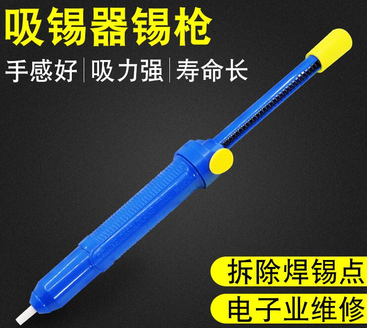

### 高温海绵
加水拧到半干的程度后用以清除烙铁头上的残锡。海绵在干燥情况下也可以做到清除残锡的作用，但效果一般且易被烙铁头烫黑。
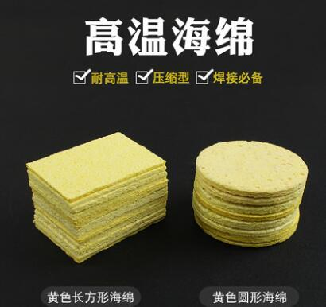

### 金丝球/铜丝球
作用类似于高温海绵，个人认为铜丝球没有海绵好使。
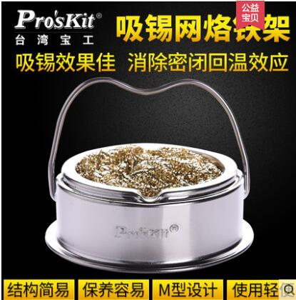

### 洗板水 Water For Cleaning Panel
洗板水即电路板清洗剂的俗称，是指用于清洗 PCB 电路板焊接过后表面残留的助焊剂与松香等用的化学工业清洗剂药水。
#### 种类
常用95%酒精和维修佬洗板水，具体分类如下：
1. 氯化溶剂洗板水
    是以氯化溶剂与其它溶剂混合而成；其溶解松香和去除助焊剂速度快，清洗后无残留易挥发无需烘干的特点。
2. 碳氢溶剂洗板水
    随着碳氢清洗剂的被广泛使用，碳氢溶剂也被用于PCB电路板的清洗；碳氢溶剂洗板水有快干型和慢干型；快干型清洗效果一般较好，碳氢溶剂洗板水具有环保、无毒、气味小、可蒸馏回收使用，其多用于高端精密类PCB电路板的清洗。
3. 水基型洗板水
    因水基清洗剂具有环保、安全、无毒、无刺激性气体挥发的特点，笔者发现2013年市面也出了水基类洗板水，但因电路板都有金属元件引脚，如果水基型洗板水不具有防锈功能时应慎用，因水基清洗剂易加快引脚的腐蚀生锈。
#### 用法注意
##### 保存条件：一定要在阴凉干燥无阳光直射的地方！！！注意防火！！！
##### 保存条件：一定要在阴凉干燥无阳光直射的地方！！！注意防火！！！
##### 保存条件：一定要在阴凉干燥无阳光直射的地方！！！注意防火！！！

## 三防漆 plastlicote
三防漆是一种特殊配方的涂料，用于保护线路板及其相关设备免受环境的侵蚀。三防漆具有良好的耐高低温性能；其固化后成一层透明保护膜，具有优越的绝缘、防潮、防漏电、防震、防尘、防腐蚀、防老化、耐电晕等性能。
三防漆根据每个地区和每个厂家使用的要求和侧重面有多种叫法，如v三防胶、防潮胶、绝缘胶、防潮漆、保护漆、防护漆、披覆胶、涂覆胶、防水胶、防潮油、三防油、三防剂、保护剂、防潮剂、保形涂料、敷型涂料、共形覆膜、共性涂覆，英文名Conformal Coating。三防漆是一种特殊配方的涂料，用于保护线路板及其相关设备免受坏境的侵蚀，从而提高并延长它们的使用寿命，确保使用的安全性和可靠性。

### 用法注意
+ > 实践中发现，风干后成功覆盖三防漆的地方绝缘性能极佳，未覆 盖的地方显然不能有很好的绝缘性能。能成功覆盖三防漆的大多为平坦圆润的地方，而有尖锐凸起处很难覆盖。
+ > 三防漆味道很重很重很重，必须选择通风条件好的地方喷涂三防漆